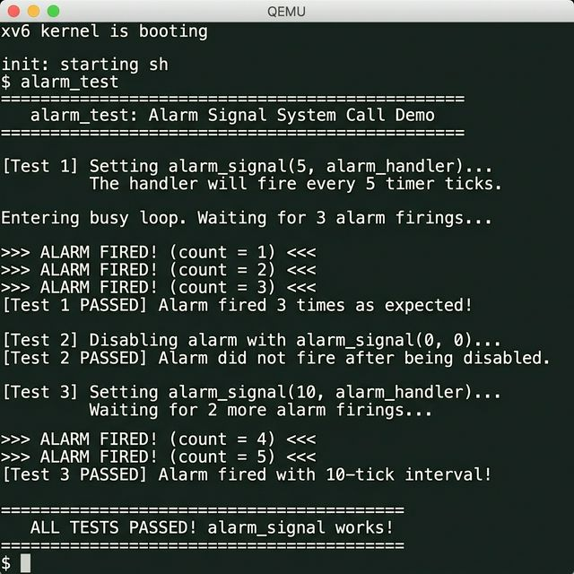

 Updated upstream
# Alarm Signal — xv6 Custom System Call Project  --Sathish
**Theme:** Kernel-level Process Control and Signal Handling
---
## Project Overview
This project implements the **`alarm_signal(int ticks, void (*handler)())`** system call in the xv6 operating system. It bridges the gap between hardware timer interrupts and user-space execution by allowing a process to register a callback function that the kernel automatically invokes after a specified number of timer ticks.

### What Does This Project Do? (Simple Explanation)

Imagine you set a kitchen timer for 5 minutes. You go back to cooking (your main work). When the timer rings, you stop cooking, go check the oven (your handler task), and then return to cooking exactly where you left off.

**That is exactly what `alarm_signal` does — but inside an operating system:**

1. A user program tells the kernel: *"Every 5 timer ticks, call this function for me."*
2. The kernel keeps counting ticks in the background while the program runs normally.
3. When 5 ticks pass, the kernel **pauses** the program, **runs the handler function**, and then **resumes** the program as if nothing happened.
4. This repeats automatically. To stop it, the program calls `alarm_signal(0, 0)`.

### Key Terms

- **Tick** — One hardware timer interrupt. The CPU generates these at a fixed rate (~10 per second in xv6). Each tick is the kernel's "heartbeat."
- **Firing** — When the alarm "goes off." After counting down the specified number of ticks, the alarm **fires** — meaning the kernel redirects the process to run the handler function. Each firing produces one `>>> ALARM FIRED! <<<` message.
- **Busy Loop** — A loop that keeps the CPU busy doing nothing useful (`while(condition) {}`). The test program uses this to keep the process running while waiting for the timer to fire. Without a busy loop, the program would exit before any alarms could fire.
- **Handler** — A user-written function that the kernel calls when the alarm fires. It must call `alarm_return()` at the end to go back to the main program.

---

## System Calls Implemented

### 1. `alarm_signal(int ticks, void (*handler)())`

| Parameter | Description |
|-----------|-------------|
| `ticks`   | Number of timer interrupts between each alarm (0 to disable) |
| `handler` | Pointer to a user-space function to call when the alarm fires |
| **Returns** | 0 on success |

### 2. `alarm_return(void)`

| Description |
|-------------|
| Must be called at the end of the alarm handler to restore the process's original execution state |
| **Returns** | Restores the original return value from before the alarm interrupted |

---

## Overall Process — Step by Step

Here is the complete flow of how the alarm works from start to finish:

### Step 1: User Program Registers the Alarm
```c
alarm_signal(5, alarm_handler);  // "Call alarm_handler every 5 ticks"
```
The kernel stores these values inside the process's `struct proc`:
- `alarm_interval = 5` (the repeat interval)
- `alarm_handler = address of alarm_handler function`
- `alarm_ticks_left = 5` (countdown starts)

### Step 2: Program Continues Running (Busy Loop)
```c
while (alarm_count < 3) {
    // The program spins here doing nothing.
    // Meanwhile, the hardware timer keeps ticking.
}
```
The program runs this loop normally. Every ~0.1 seconds, a **timer interrupt** fires and the CPU enters the kernel.

### Step 3: Kernel Counts Down on Each Timer Tick
Inside `usertrap()` in `kernel/trap.c`, on every timer interrupt:
```
tick 1: alarm_ticks_left = 4  → not yet, keep going
tick 2: alarm_ticks_left = 3  → not yet
tick 3: alarm_ticks_left = 2  → not yet
tick 4: alarm_ticks_left = 1  → not yet
tick 5: alarm_ticks_left = 0  → ALARM FIRES!
```

### Step 4: Alarm Fires — Kernel Saves State and Redirects
When the countdown reaches 0:
1. The kernel **saves the entire trapframe** (all 32 CPU registers + program counter) into `alarm_saved_tf`
2. The kernel **overwrites the program counter** (`epc`) to point to `alarm_handler`
3. Sets `alarm_active = 1` to prevent double-firing
4. Returns to user space → the CPU now executes `alarm_handler` instead of the busy loop

### Step 5: Handler Runs and Returns
```c
void alarm_handler(void) {
    alarm_count++;                                          // Increment counter
    printf(">>> ALARM FIRED! (count = %d) <<<\n", alarm_count); // Print message
    alarm_return();                                         // Tell kernel: "I'm done"
}
```
When `alarm_return()` is called:
1. The kernel **restores the saved trapframe** back into the process
2. Resets `alarm_ticks_left = 5` (start counting again)
3. Clears `alarm_active = 0` (allow future alarms)
4. The process **resumes the busy loop** exactly where it was interrupted

### Step 6: Repeat
The cycle repeats. After 5 more ticks, the alarm fires again (count = 2), then again (count = 3). When `alarm_count` reaches 3, the busy loop's condition `alarm_count < 3` becomes false, and the program moves on to Test 2.

---

## How the Kernel Does It — Trapframe Save/Restore

The **trapframe** is the critical data structure. It holds all 32 CPU registers and the program counter. Here's the flow diagram:

```
┌─────────────────────────────────────────────────────────────┐
│  User Process Running (e.g., busy loop at address 0x1234)   │
└─────────────────────────────┬───────────────────────────────┘
                              │ Timer interrupt!
                              ▼
┌─────────────────────────────────────────────────────────────┐
│  Kernel: usertrap()                                         │
│  1. Decrement alarm_ticks_left                              │
│  2. If reached zero:                                        │
│     a. SAVE entire trapframe → alarm_saved_tf               │
│     b. Set trapframe->epc = alarm_handler address           │
│     c. Set alarm_active = 1 (prevent re-entry)              │
└─────────────────────────────┬───────────────────────────────┘
                              │ Return to user space
                              ▼
┌─────────────────────────────────────────────────────────────┐
│  User: alarm_handler() executes                             │
│  - Prints ">>> ALARM FIRED! <<<" message                    │
│  - Calls alarm_return()                                     │
└─────────────────────────────┬───────────────────────────────┘
                              │ System call
                              ▼
┌─────────────────────────────────────────────────────────────┐
│  Kernel: sys_alarm_return()                                 │
│  1. RESTORE alarm_saved_tf → trapframe                      │
│  2. Reset alarm_ticks_left = alarm_interval                 │
│  3. Clear alarm_active = 0                                  │
└─────────────────────────────┬───────────────────────────────┘
                              │ Return to user space
                              ▼
┌─────────────────────────────────────────────────────────────┐
│  User Process Resumes at original address 0x1234            │
│  (all registers restored — process doesn't know it          │
│   was interrupted!)                                         │
└─────────────────────────────────────────────────────────────┘
```

### Why `alarm_active` Is Needed

Without this guard flag, if the alarm handler takes longer than `N` ticks to execute, the kernel would try to fire the alarm *again* while the handler is still running—corrupting the saved trapframe. The `alarm_active` flag prevents this re-entrant scenario.

---

## Files Modified and What Each Change Does

| # | File | What Was Changed | Why |
|---|------|-----------------|-----|
| 1 | `kernel/proc.h` | Added 5 new fields to `struct proc` | Each process needs its own alarm state (interval, handler, countdown, guard flag, saved registers) |
| 2 | `kernel/proc.c` | Initialize alarm fields in `allocproc()`, cleanup in `freeproc()`, copy in `kfork()` | When a process is created, its alarm must start as disabled; when it forks, the child inherits the alarm; when it exits, the alarm memory must be freed |
| 3 | `kernel/syscall.h` | Added `#define SYS_alarm_signal 22` and `#define SYS_alarm_return 23` | Every system call needs a unique number so the kernel can identify which call the user is making |
| 4 | `kernel/syscall.c` | Added `sys_alarm_signal` and `sys_alarm_return` to the dispatch table | The kernel uses this table to map system call numbers to their handler functions |
| 5 | `kernel/sysproc.c` | Implemented `sys_alarm_signal()` and `sys_alarm_return()` functions | These are the actual kernel functions that set up the alarm and restore the trapframe |
| 6 | `kernel/trap.c` | Added alarm countdown + trapframe save/redirect logic in `usertrap()` | This is the **core logic** — on every timer tick, check if alarm should fire and redirect the process |
| 7 | `user/user.h` | Added function declarations for `alarm_signal()` and `alarm_return()` | User programs need to know these functions exist so they can call them |
| 8 | `user/usys.pl` | Added assembly stub entries | Generates the assembly code that makes the actual `ecall` instruction to enter the kernel |
| 9 | `user/alarm_test.c` | **NEW FILE** — Test program with 3 tests | Demonstrates and validates the alarm system call works correctly |
| 10 | `Makefile` | Added `_alarm_test` to `UPROGS` list | Tells the build system to compile the test program and include it in the xv6 disk image |

---

## Key Code Changes

### 1. `struct proc` — New Alarm Fields (`kernel/proc.h`)

```c
// Alarm signal fields
int alarm_interval;            // Timer interval in ticks (0 = disabled)
uint64 alarm_handler;          // User-space handler function address
int alarm_ticks_left;          // Countdown to next alarm firing
int alarm_active;              // Guard: 1 while handler is executing
struct trapframe *alarm_saved_tf; // Saved trapframe for alarm_return()
```

### 2. Alarm Check in `usertrap()` (`kernel/trap.c`)

This is the **most important code** — it runs on every timer interrupt:

```c
// On every timer tick, check if this process has a pending alarm.
if(which_dev == 2 && p->alarm_interval > 0 && p->alarm_active == 0) {
  p->alarm_ticks_left--;
  if(p->alarm_ticks_left <= 0) {
    // Save the entire trapframe so alarm_return() can restore it.
    memmove(p->alarm_saved_tf, p->trapframe, sizeof(struct trapframe));
    // Redirect the process to execute the alarm handler.
    p->trapframe->epc = p->alarm_handler;
    // Prevent re-entrant alarms while handler is running.
    p->alarm_active = 1;
  }
}
```

**Line-by-line explanation:**
- `which_dev == 2` → This was a timer interrupt (not keyboard or disk)
- `p->alarm_interval > 0` → This process has an alarm set
- `p->alarm_active == 0` → The handler is not already running
- `p->alarm_ticks_left--` → Count down one tick
- `memmove(...)` → Copy all registers to the backup
- `p->trapframe->epc = p->alarm_handler` → Change where the process will resume — instead of returning to the busy loop, it will jump to the handler
- `p->alarm_active = 1` → Block further alarms until handler finishes

### 3. Trapframe Restore in `sys_alarm_return()` (`kernel/sysproc.c`)

```c
uint64 sys_alarm_return(void) {
  struct proc *p = myproc();
  // Copy the saved registers back, restoring the exact CPU state
  memmove(p->trapframe, p->alarm_saved_tf, sizeof(struct trapframe));
  // Start counting ticks again for the next alarm
  p->alarm_ticks_left = p->alarm_interval;
  // Allow alarms to fire again
  p->alarm_active = 0;
  return p->trapframe->a0;
}
```

### 4. The Alarm Handler in User Space (`user/alarm_test.c`)

This is the code that prints `">>> ALARM FIRED! (count = 1) <<<"`:

```c
// Global counter — starts at 0, incremented each time the alarm fires
volatile int alarm_count = 0;

void alarm_handler(void)
{
  alarm_count++;    // 0→1 on first firing, 1→2 on second, 2→3 on third
  printf(">>> ALARM FIRED! (count = %d) <<<\n", alarm_count);
  alarm_return();   // MUST call this — tells kernel to restore saved state
}
```

**How the count works:**
- The variable `alarm_count` is **global** and marked `volatile` (so the compiler doesn't optimize away reads from it)
- First alarm firing: `alarm_count` goes from 0 → 1, prints `count = 1`
- Second alarm firing: `alarm_count` goes from 1 → 2, prints `count = 2`
- Third alarm firing: `alarm_count` goes from 2 → 3, prints `count = 3`
- The main busy loop checks `while (alarm_count < 3)` — once count reaches 3, the loop exits

---

## Test Program — Detailed Explanation

### Test 1: Periodic Alarm (5-tick interval, 3 firings)
```c
alarm_signal(5, alarm_handler);    // Set alarm for every 5 ticks
while (alarm_count < 3) { }       // Busy loop — wait for 3 firings
```
- **Why 3 firings?** We chose 3 to prove the alarm is **repeating** — it's not a one-time event. After each firing, `alarm_return()` resets the countdown and the alarm fires again. Three firings prove the cycle works correctly.

### Test 2: Disabling the Alarm
```c
alarm_signal(0, 0);                // Disable — set interval to 0
for (int i = 0; i < 500000000; i++) { }  // Spin for a long time
```
- After disabling, we spin for a long time. If no alarm fires during this period, the disable works correctly.

### Test 3: Different Interval (10-tick interval, 2 firings)
```c
alarm_signal(10, alarm_handler);   // Re-enable with 10 ticks
while (alarm_count < target) { }   // Wait for 2 more firings
```
- **Why only 2 firings for Test 3?** Because we already proved the alarm repeats in Test 1 (3 firings). Test 3's purpose is different — it proves the system call works with **any tick value**, not just 5. Two firings is enough to confirm the 10-tick interval works. The alarm count continues from where it left off (count 4 and 5).

---

## Execution Screenshot

The screenshot below shows `alarm_test` running inside xv6 on QEMU. All 3 tests pass successfully:



**What the output shows:**
- **Test 1**: Three `>>> ALARM FIRED! <<<` messages appear at count 1, 2, 3 — proving the 5-tick periodic alarm works
- **Test 2**: No alarm messages appear — proving the alarm was successfully disabled
- **Test 3**: Two more `>>> ALARM FIRED! <<<` messages at count 4, 5 — proving the 10-tick interval works
- **Final line**: `ALL TESTS PASSED! alarm_signal works!`

---

## How to Build and Run

```bash
# Navigate to the xv6 directory
cd G7_Project1_xv6CustomizeSystemCalls/xv6/

# Clean and build
make clean
make qemu CPUS=1

# Inside xv6 shell, run the test
$ alarm_test
```

## Five System Call Functionalities Covered

This project satisfies the requirement of modifying/implementing system calls across multiple OS functionality areas:

1. **Signals** — `alarm_signal()` implements a SIGALRM-like timer signal mechanism
2. **Process Control** — The kernel tracks per-process alarm state and controls execution flow
3. **Inter-Process Communication** — The trapframe save/restore mechanism is a form of kernel-to-user signaling
4. **Process Creation** — `kfork()` was modified to properly inherit alarm state to child processes
5. **Locks / Concurrency** — The `alarm_active` re-entrancy guard prevents race conditions when the handler runs longer than the alarm interval
# Message Passing IPC --Gaurav

This project adds message-passing inter-process communication to xv6.

The implementation introduces two new system calls, `sendmsg` and `recvmsg`, and backs them with a per-process single-slot mailbox in the kernel. The design uses blocking semantics so that communication behaves like a simple synchronous IPC mechanism.

## Overview

Each process owns one mailbox slot.

- `sendmsg` places one message into the target process's mailbox.
- `recvmsg` removes one message from the caller's mailbox.
- If the mailbox is full, `sendmsg` blocks until the receiver consumes the message.
- If the mailbox is empty, `recvmsg` blocks until a sender provides data.

This keeps the implementation compact while still demonstrating synchronization, sleep/wakeup behavior, and kernel-managed IPC.

## System Call Interface

### `sendmsg`

User-space prototype:

```c
int sendmsg(int pid, void *msg, int len);
```

Description:

- Sends `len` bytes from the calling process to process `pid`.
- Copies data from the sender's address space into the receiver's mailbox.
- Returns `0` on success.
- Returns `-1` on invalid input or failure.

Behavior:

- Rejects messages larger than `MSGSIZE`.
- Blocks while the destination mailbox is full.
- Wakes the receiver after storing a message.

### `recvmsg`

User-space prototype:

```c
int recvmsg(int *src_pid, void *buf, int maxlen);
```

Description:

- Receives the pending mailbox message for the calling process.
- Copies the sender pid into `*src_pid`.
- Copies up to `maxlen` bytes into `buf`.
- Returns the number of bytes copied.
- Returns `-1` on invalid input or failure.

Behavior:

- Blocks while the mailbox is empty.
- Clears the mailbox after a successful receive.
- Wakes any blocked sender after consuming the message.

## Kernel Changes

The mailbox is stored directly in `struct proc`.

Added fields:

- `msg_lock` for synchronization
- `mailbox_full` to indicate whether the slot is occupied
- `mailbox_src_pid` to record the sender
- `mailbox_len` to store the payload size
- `mailbox_data[MSGSIZE]` to store the payload bytes

`MSGSIZE` is defined as `128` bytes.

Initialization and cleanup:

- Mailbox fields are initialized in `allocproc`.
- Mailbox state is cleared again in `freeproc`.

## Blocking Model

The mailbox uses xv6 sleep/wakeup primitives to coordinate senders and receivers.

- A sender sleeps while the receiver's mailbox is full.
- A receiver sleeps while its mailbox is empty.
- Successful send operations wake the waiting receiver.
- Successful receive operations wake waiting senders.

This provides a deterministic one-message-at-a-time communication path.

## Files Modified

### Kernel

- `xv6/kernel/proc.h` - added mailbox fields to `struct proc`
- `xv6/kernel/proc.c` - initialized and cleared mailbox state
- `xv6/kernel/sysproc.c` - implemented `sys_sendmsg` and `sys_recvmsg`
- `xv6/kernel/syscall.h` - added syscall numbers
- `xv6/kernel/syscall.c` - registered syscall handlers

### User Space

- `xv6/user/user.h` - added user-space prototypes
- `xv6/user/usys.pl` - generated syscall stubs
- `xv6/user/mailboxtest.c` - test program for blocking IPC

### Build System

- `xv6/Makefile` - added `_mailboxtest` to the user program list

## Test Program

The user test program `mailboxtest` demonstrates the IPC flow.

Scenario:

1. Parent sends the first message.
2. Parent attempts to send a second message and blocks if the mailbox is still occupied.
3. Child receives the first message.
4. The blocked sender is unblocked.
5. Child receives the second message.

This confirms that the mailbox enforces one-slot communication and proper blocking behavior.

## Build and Run

From the `xv6/` directory:

```bash
make qemu
```

Inside the xv6 shell:

```bash
mailboxtest
```

Expected output shows the sender pid and the two messages being transferred in order.

## Notes

- The mailbox is intentionally a single-slot buffer rather than a queue.
- The design is focused on clarity and synchronization, not throughput.
- This implementation is suitable for demonstrating core IPC concepts in xv6.

# 📌 Project 1 – xv6 System Call Customization  (getprocinfo) --John

## 👤 Contribution Scope

This module focuses on **process inspection and metadata enhancement** in the xv6 operating system. It introduces new system calls and extends process structures to enable user-space programs to retrieve detailed information about running processes.

---

## 🚀 Implemented Features

### 1. `getppid()` System Call

Returns the parent process ID of the calling process.

**Purpose:**

* Understand process hierarchy
* Validate parent-child relationships

**Example Output:**

```
PID: 3, PPID: 2
```

---

### 2. `getprocinfo(int pid, struct procinfo *info)` System Call

Retrieves detailed information about a specific process.

**Fields Returned:**

* `pid` → Process ID
* `state` → Process state (RUNNING, SLEEPING, etc.)
* `sz` → Memory size
* `parent_pid` → Parent process ID
* `priority` → Process priority

---

## 🧠 Data Structures

### Kernel Side (`kernel/proc.h`)

```c
struct procinfo {
    int pid;
    int state;
    int sz;
    int parent_pid;
    int priority;
};
```

### Process Structure Extension

```c
struct proc {
    ...
    int priority;   // Added field
};
```

---

## ⚙️ System Call Workflow

```
User Program (testproc.c)
        ↓
User Stub (usys.pl → usys.S)
        ↓
sys_getprocinfo() (sysproc.c)
        ↓
Process Table Traversal (proc[])
        ↓
copyout() → User Space
```

---

## 🧪 Test Program (`testproc.c`)

A user-level program was developed to:

* Invoke system calls
* Display process details in a formatted table (ps-like view)

### Sample Output

```
PID     STATE           SIZE    PARENT  PRIORITY
------------------------------------------
1       SLEEPING        16384   -1      5
2       SLEEPING        20480   1       5
3       RUNNING         16384   2       5
```

---

## 🔧 Key Implementation Details

### Argument Handling

* `argint()` → fetch integer arguments
* `argaddr()` → fetch pointer arguments

### Memory Transfer

* `copyout()` used to safely transfer data from kernel to user space

### Process Traversal

* Iteration over `proc[NPROC]` to locate matching PID

---

## ⚠️ Challenges Faced

1. **Kernel-User Data Transfer**

   * Direct struct return is not possible → solved using `copyout()`

2. **xv6-riscv Differences**

   * `argint()` and `argaddr()` return `void` (not int)

3. **Structure Synchronization**

   * Ensured identical `procinfo` struct in both kernel and user space

4. **Formatting Output**

   * Implemented aligned printing for readability

---

## 📈 Enhancements Made

* Added `priority` field to process structure
* Introduced human-readable process states
* Built a **ps-like process viewer** in user space

---

## 🧩 Learning Outcomes

* System call design and implementation
* Kernel-user boundary handling
* Process table management
* Safe memory operations (`copyout`)
* Struct synchronization across layers

---

## ✅ Conclusion

This module transforms xv6 from a basic OS into a more **introspective system**, enabling users to:

* Inspect process states
* Understand process relationships
* Analyze memory usage and scheduling attributes

The implementation demonstrates practical understanding of **operating system internals and system call mechanisms**.

---

# Syscall Logger Enhancement -- Yesaswini

This part adds a **real-time syscall logging mechanism** to xv6 that captures every system call made by a process ( filters write, read and "sh" processes ) and displays them **after the process completes** - keeping the output clean and readable.

---

## What this syscall() function does actually

In the context of xv6, the syscall() function acts like a traffic controller. It is the central junction that takes a request from the user program and routes it to the correct part of the operating system kernel. Here is the breakdown of what it does step-by-step:

1. **It identifies the request:** When a user program (like our syscall logger) wants the kernel to do something, it puts a **System call number** into a specific CPU register. The syscall() function reads this number from the process's Trap Frame.

2. **It validates the call:** The function checks if the provided number is valid.
   * **If valid:** It uses that number as an index to look up a function pointer in a table (usually called syscalls[]).
   * **If invalid:** It prints an error message (like "unknown syscall") and returns -1.

3. **It executes and stores the result:** Once it finds the correct internal function (like sys_fork, sys_write, or any others), it runs that function.

   After the kernel function finished, syscall() takes the return value and saves it back into the register of the trap frame so the user program can see if the operation succeeded or failed.

---

## What was implemented

A buffer based syscall logger that:

* Intercepts every syscall in the kernel
* Stores them during process execution
* Prints all syscalls together after the process finishes - not during execution

---

## Files modified

* `kernel/syscall.c` - Added `syscall_names[]` array mapping syscall numbers to names. Added buffer storage logic after each syscall executes.

* `kernel/proc.h` - Added `syscall_log[100]` and `syscall_count` to proc struct.

* `kernel/proc.c` - Initialize buffer in `allocproc()`. Print and  reset buffer in `freeproc()` when process exists.

---

## System Verification (Screenshots)
 
* **Kernel Boot Sequence:** When the xv6 kernel boots, the system initiates several background processes like **init** and **sh**. This logger captures these initial handshakes between the hardware and software.


The termial showing syscalls being logged automatically during the xv6 boot process.

* **User Program Execution:** Beyond boot-up, the logger also tracks specific user-run programs. This allows developers to see exactly how many **read**, **write** or **process = "sh"** calls a simple command actually triggers.


Here, you can also observe syscalls are printed just after their execution.

* **Buffer Logger Enhancement:** Initially the terminal was flodded with system calls. This was fixed by implementing a buffer approach  - syscalls are now stored during execution and printed together after the process completes, keeping the output clean and readable. 


---

## How to test

To see the buffer logger in action:

1. **Clean and Rebuild:**
   ```bash
   make clean
   make qemu

2. **Run any program in xv6 shell:**
   ```bash
   $ syscall_test
   $ getprocinfo
   $ mailboxtest

3. **Observe the output:**
   Program output appears first followed by all system calls together at the end.

4. **Verify:**
   Each syscall made during the program execution will be printed.
   After if finishes - not during!

---

## Challenges faced

1. **Terminal flooding**
   * Initially every syscall printed immediately
   * Fixed using buffer approach

2. **Double syscall execution**
   * Logger accidentally called syscall twice
   * Fixed by merging into single if block

3. **Buffer printing after every syscall**
   * Wrong placement of print logic
   * Fixed it by placing it in the right spot in freeproc()

---

## Learning Outcomes

* Kernel process lifecycle management

* Buffer management in kernel space

* Syscall interception techniques

* Process struct modification in xv6

---

**This logger makes xv6 **transparent** - every syscall a process makes is captured and shown after it finishes, helping understand OS internals clearly.**

# Documentation
 Stashed changes
