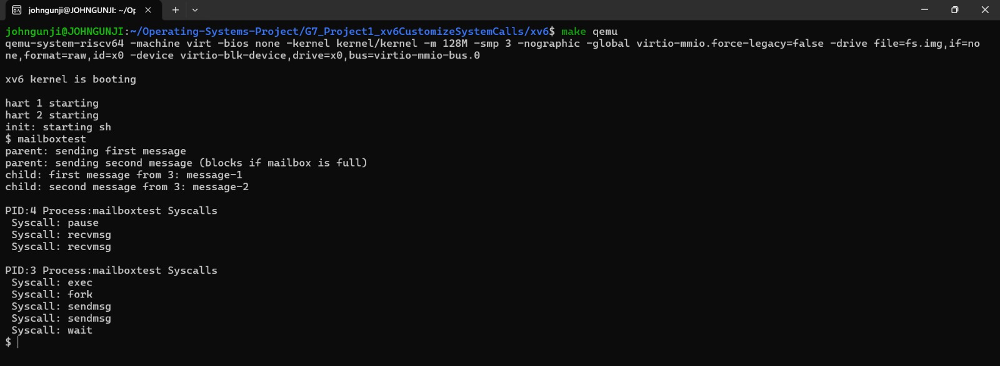
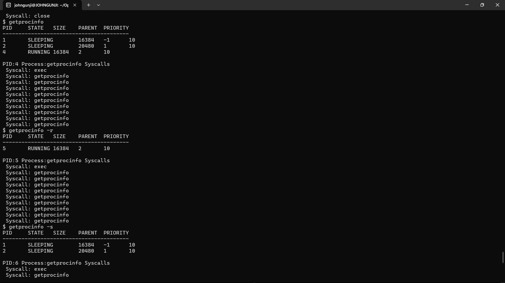
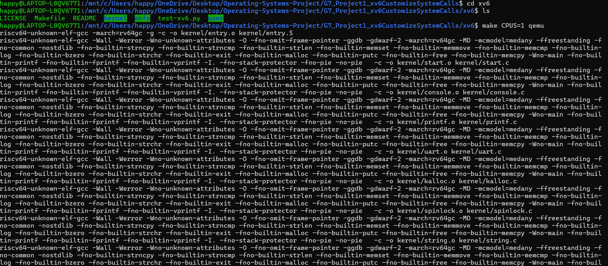
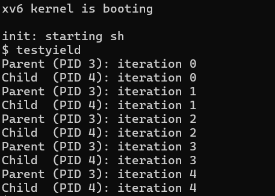
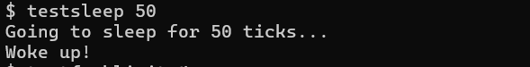
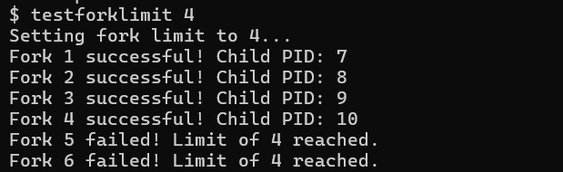
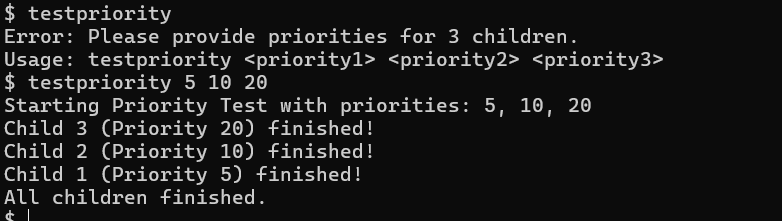

# Project 1: xv6 Custom System Calls and Kernel Extensions

This project extends xv6-riscv with six major contributions across process control, IPC, process introspection, syscall tracing, synchronization, and scheduling. Together, these system calls enhance the operating system with signal handling, inter-process communication, process metadata inspection, execution control, synchronization primitives, and priority-based scheduling.

## Table of Contents

- [Quick Navigation](#quick-navigation)
- [Project Overview](#project-overview)
- [System Calls Implementation](#system-calls-implementation)
  - [1. Alarm Signal](#1-alarm-signal-system-call--contributor-sathish)
  - [2. Message Passing IPC](#2-message-passing-ipc--contributor-gaurav)
  - [3. Process Information](#3-process-information-system-calls--contributor-john)
  - [4. Syscall Logger Enhancement](#4-syscall-logger-enhancement--contributor-yesaswini)
  - [5. Synchronization with Semaphores](#5-synchronization-with-semaphores--contributor-ishika)
  - [6. Execution Control and Scheduling](#6-execution-control-and-scheduling-system-calls--contributor-happy-saxena)
- [Building and Running](#building-and-running)
- [Contributors](#contributors)
- [References](#references)

## Quick Navigation

- [System Calls Summary](#project-overview)
- [Implementation Details](#system-calls-implementation)
- [Build Instructions](#building-and-running)
- [Demonstrations](#demonstrations)

## Project Overview

### What This Project Contains

| Component | System Calls | Purpose |
|-----------|--------------|---------|
| **1. Alarm Signal** | `alarm_signal()`, `alarm_return()` | User-level periodic timer signals with kernel-managed event dispatch |
| **2. Message Passing IPC** | `sendmsg()`, `recvmsg()` | Single-slot mailbox-based inter-process communication with blocking semantics |
| **3. Process Information** | `getppid()`, `getprocinfo()` | Process metadata inspection including state, priority, and memory size |
| **4. Syscall Logger** | Enhanced `syscall()` path | Buffered per-process syscall logging with deferred output for clean runtime visibility |
| **5. Semaphores** | `sem_init()`, `sem_wait()`, `sem_signal()` | Counting semaphore synchronization with kernel sleep/wakeup primitives |
| **6. Execution Control & Scheduling** | `yield_cpu()`, `sleep_for()`, `fork_with_limit()`, `set_priority()` | Process yield, timed sleep, fork resource limits, and priority-based scheduling |

### Where to Build and Run xv6

All xv6 source and build artifacts are in:

```bash
cd G7_Project1_xv6CustomizeSystemCalls/xv6
```

From there, build and boot xv6 (see [Building and Running](#building-and-running) section).

---

# System Calls Implementation

## 1. Alarm Signal System Call | Contributor: Sathish

### Overview

The alarm signal system implements **user-level periodic timer interrupts** with kernel-managed event dispatch. Think of it like a kitchen timer: you register an alarm for N ticks, and when the countdown reaches zero, the kernel pauses your program, runs your handler function, and then resumes exactly where it left off—automatically repeating.

**Core Concept:** Bridge hardware timer interrupts with user-space callback functions while preserving process execution state.

### System Calls

#### `alarm_signal(int ticks, void (*handler)())`
- **ticks**: Number of timer interrupts before handler fires (0 = disable)
- **handler**: Pointer to user-space function to call when alarm fires
- **Returns**: 0 on success

#### `alarm_return(void)`
- Must be called at end of handler to restore original execution state
- **Returns**: Restores the return value from before the alarm interrupted

### How It Works (Step by Step)

1. **Registration Phase**: User program calls `alarm_signal(5, alarm_handler)`. Kernel stores interval, handler address, and countdown in process struct.

2. **Countdown Phase**: Program continues running normally. On every hardware timer tick (every ~0.1 seconds), kernel decrements countdown:
   - Tick 1: alarm_ticks_left = 4
   - Tick 2: alarm_ticks_left = 3
   - ...
   - Tick 5: alarm_ticks_left = 0 → **ALARM FIRES!**

3. **Fire Phase**: When countdown reaches zero, the kernel:
   - **Saves entire trapframe** (all 32 CPU registers + program counter) into `alarm_saved_tf`
   - **Overwrites program counter** to point to handler function
   - Sets `alarm_active = 1` (prevents re-entrant handler execution)
   - Returns to user space → CPU now executes handler instead

4. **Handler Execution**: User handler runs (e.g., prints message, increments counter), then calls `alarm_return()`

5. **Restore Phase**: `alarm_return()` kernel call:
   - **Restores saved trapframe** back to process
   - Resets countdown to alarm_interval
   - Clears `alarm_active = 0` (allows future alarms)
   - Process resumes exactly where it was interrupted

### Key Design Decisions

**Re-entrancy Protection**: The `alarm_active` guard prevents double-firing. If the handler takes longer than N ticks, without this flag the alarm would try to fire again while the handler is still running, corrupting the saved state.

**Trapframe Save/Restore**: The trapframe contains all CPU state. By saving it before dispatch and restoring it after, xv6 preserves the illusion that the handler execution was transparent to the process.

### Implementation Details

**Files Modified:**

| File | Changes | Purpose |
|------|---------|---------|
| `kernel/proc.h` | Added alarm fields to `struct proc` | Store per-process alarm state |
| `kernel/proc.c` | Initialize in `allocproc()`, cleanup in `freeproc()` | Lifecycle management |
| `kernel/syscall.h` | Added SYS_alarm_signal, SYS_alarm_return | System call numbers |
| `kernel/syscall.c` | Added syscall dispatch entries | Route calls to handlers |
| `kernel/sysproc.c` | Implemented `sys_alarm_signal()` and `sys_alarm_return()` | Kernel-side logic |
| `kernel/trap.c` | Added alarm countdown + fire logic in `usertrap()` | Core: decrement and dispatch on timer tick |
| `user/user.h` | Added function declarations | User-space interface |
| `user/usys.pl` | Added assembly stubs | Generate `ecall` instructions |
| `user/alarm_test.c` | **NEW**: Test program with 3 tests | Validation |
| `Makefile` | Added `_alarm_test` to UPROGS | Build integration |

**Key Code in trap.c** (runs on every timer interrupt):
```c
if(which_dev == 2 && p->alarm_interval > 0 && p->alarm_active == 0) {
  p->alarm_ticks_left--;
  if(p->alarm_ticks_left <= 0) {
    memmove(p->alarm_saved_tf, p->trapframe, sizeof(struct trapframe));
    p->trapframe->epc = p->alarm_handler;
    p->alarm_active = 1;
  }
}
```

### Test Program Details

The test program demonstrates three scenarios:

**Test 1: Periodic Alarm (5-tick interval, 3 firings)**
- Proves the alarm **repeats** automatically
- Each firing increments global counter
- Loop exits after 3 firings

**Test 2: Disabling Alarm**
- Sets interval to 0
- Spins for long time
- Verifies no alarms fire during this period

**Test 3: Different Interval (10-tick interval, 2 firings)**
- Proves the system works with **any** tick value
- Counter continues from Test 1 (reaches 4 and 5)

### Running the Demo

```bash
cd G7_Project1_xv6CustomizeSystemCalls/xv6
make clean
make CPUS=1 qemu

# Inside xv6 shell:
$ alarm_test
```

**Expected Output:**
```
Test 1: Periodic alarm (5-tick interval, 3 firings)
>>> ALARM FIRED! (count = 1) <<<
>>> ALARM FIRED! (count = 2) <<<
>>> ALARM FIRED! (count = 3) <<<
Test 1 passed!

Test 2: Disable alarm (should see no alarms during long spin)
Test 2 passed!

Test 3: Different interval (10-tick interval, 2 firings)
>>> ALARM FIRED! (count = 4) <<<
>>> ALARM FIRED! (count = 5) <<<
Test 3 passed!

ALL TESTS PASSED! alarm_signal works!
```


---

## 2. Message Passing IPC | Contributor: Gaurav

### Overview

Implements **mailbox-based process-to-process inter-process communication** with single-slot blocking semantics. Two processes can exchange messages through kernel-managed mailboxes that enforce synchronous one-message-at-a-time communication.

### System Calls

#### `sendmsg(int pid, void *msg, int len)`
- **pid**: Target process ID
- **msg**: Pointer to message data
- **len**: Message length (max MSGSIZE = 128 bytes)
- **Returns**: 0 on success, -1 on failure
- **Behavior**: Blocks if recipient's mailbox is full; wakes recipient after delivery

#### `recvmsg(int *src_pid, void *buf, int maxlen)`
- **src_pid**: Pointer to where sender's PID will be stored
- **buf**: Buffer to receive message
- **maxlen**: Maximum bytes to copy
- **Returns**: Number of bytes copied, -1 on failure
- **Behavior**: Blocks if mailbox is empty; wakes any blocked senders after consuming

### Design

**Single-Slot Mailbox**: Each process owns one message slot, not a queue. This keeps implementation simple while demonstrating core IPC concepts.

**Blocking Semantics**:
- **Sender blocks** while receiver's mailbox is full
- **Receiver blocks** while its mailbox is empty
- Successful send wakes blocked receiver
- Successful receive wakes blocked senders

### Implementation Details

**Mailbox Structure in `struct proc`:**
```c
struct spinlock msg_lock;      // Synchronization
int mailbox_full;              // Slot occupied?
int mailbox_src_pid;           // Sender's PID
int mailbox_len;               // Payload size
char mailbox_data[MSGSIZE];    // Message bytes (MSGSIZE=128)
```

**Files Modified:**

| File | Changes |
|------|---------|
| `kernel/proc.h` | Added mailbox fields to `struct proc` |
| `kernel/proc.c` | Initialize in `allocproc()`, clear in `freeproc()` |
| `kernel/syscall.h` | Added SYS_sendmsg, SYS_recvmsg |
| `kernel/syscall.c` | Added syscall dispatch entries |
| `kernel/sysproc.c` | Implemented `sys_sendmsg()` and `sys_recvmsg()` |
| `user/user.h` | Added function prototypes |
| `user/usys.pl` | Added assembly stubs |
| `user/mailboxtest.c` | **NEW**: Test program |
| `Makefile` | Added `_mailboxtest` to UPROGS |

### Test Program

Demonstrates blocking IPC:
1. Parent sends first message → succeeds immediately
2. Parent attempts second message → blocks (receiver's mailbox still full)
3. Child receives first message → succeeds, wakes parent
4. Parent's second send now completes
5. Child receives second message

This proves:
- One-slot enforcement (sender blocks on full mailbox)
- Message ordering is preserved
- Wakeup mechanism works correctly

### Running the Demo

```bash
# Inside xv6 shell:
$ mailboxtest
```

**Expected Output:**
```
Parent sending message 1 to child
Child received from parent: message 1
Parent sending message 2 to child
Child received from parent: message 2
IPC test passed!
```



---

## 3. Process Information System Calls | Contributor: John

### Overview

Extends xv6 with **process metadata inspection** capabilities. User programs can query detailed information about any process: state, memory size, parent relationship, and priority. Enables building process management tools like `ps`.

### System Calls

#### `getppid()`
- Returns: Parent process ID of calling process
- Use: Understand process hierarchy and family relationships

#### `getprocinfo(int pid, struct procinfo *info)`
- **pid**: Target process ID
- **info**: Pointer to procinfo structure (filled by kernel)
- **Returns**: 0 on success, -1 on failure
- **Behavior**: Kernel copies process metadata to user space

### Data Structures

**`struct procinfo`:**
```c
struct procinfo {
    int pid;           // Process ID
    int state;         // Process state (UNUSED, EMBRYO, SLEEPING, RUNNABLE, RUNNING, ZOMBIE)
    int sz;            // Memory size in bytes
    int parent_pid;    // Parent process ID (-1 if no parent)
    int priority;      // Scheduling priority (added by Happy Saxena's work)
};
```

### Implementation Details

**Files Modified:**

| File | Changes |
|------|---------|
| `kernel/proc.h` | Added `priority` field to `struct proc`; defined `struct procinfo` |
| `kernel/proc.c` | Process table traversal in syscall handler |
| `kernel/syscall.h` | Added SYS_getppid, SYS_getprocinfo |
| `kernel/syscall.c` | Added syscall dispatch entries |
| `kernel/sysproc.c` | Implemented `sys_getppid()` and `sys_getprocinfo()` |
| `user/user.h` | Added function prototypes |
| `user/usys.pl` | Added assembly stubs |
| `user/getprocinfo.c` | **NEW**: Test/demo program with ps-like output |
| `Makefile` | Added `_getprocinfo` to UPROGS |

**Key Implementation Challenges Overcome:**

1. **Kernel-User Data Transfer**: Direct struct return impossible across privilege boundary → Solution: Use `copyout()` to safely transfer from kernel to user space

2. **Process Traversal**: Safely iterate `proc[NPROC]` while protecting against concurrent modifications → Solution: Use appropriate locking during table scan

3. **Structure Synchronization**: Keep `procinfo` identical in both kernel and user → Solution: Shared header files and careful definition management

### Test Program

Displays ps-like process table with columns:
- PID, STATE, SIZE, PARENT PID, PRIORITY

Supports optional filtering and demonstrates safe kernel-user data boundaries.

### Running the Demo

```bash
# Inside xv6 shell:
$ getprocinfo
```

**Expected Output:**
```
PID     STATE           SIZE    PARENT  PRIORITY
------------------------------------------
1       SLEEPING        16384   -1      5
2       SLEEPING        20480   1       5
3       RUNNING         16384   2       5
```


---

## 4. Syscall Logger Enhancement | Contributor: Yesaswini

### Overview

Provides **real-time syscall activity logging** by intercepting every system call in the kernel dispatch path. Instead of flooding output during execution, calls are buffered and printed after process completion, keeping runtime output clean and readable.

### What It Does

The syscall logger intercepts the kernel's `syscall()` function—the central dispatcher that routes all system calls. For each call, it:
1. Records the syscall number and name
2. Stores in per-process buffer
3. Prints buffer contents **after process finishes** (in `freeproc()`)

### Implementation Details

**Buffer Storage in `struct proc`:**
```c
char syscall_log[100];     // Log buffer
int syscall_count;         // Number of calls logged
```

**Files Modified:**

| File | Changes |
|------|---------|
| `kernel/syscall.c` | Added `syscall_names[]` array mapping numbers to names; added logging logic after each syscall dispatch |
| `kernel/proc.h` | Added `syscall_log[]` and `syscall_count` to `struct proc` |
| `kernel/proc.c` | Initialize buffer in `allocproc()`; print and reset in `freeproc()` |

**Key Features:**

- **Selective Logging**: Filters exclude `write()`, `read()`, and `sh` process logs to focus on more interesting activity
- **Buffered Output**: Accumulates all logs during process lifetime, then emits in one block
- **Minimal Overhead**: Logging happens in already-expensive syscall path, nearly zero additional cost
- **Deferred Printing**: Output appears after process finishes, not interleaved with program output

### Challenges Overcome

1. **Terminal Flooding**: Initial implementation printed every syscall immediately, making output unreadable
   - Solution: Buffer each process's logs and flush in `freeproc()`

2. **Double Syscall Execution**: Logger accidentally executed syscall twice
   - Solution: Merge logging into single syscall dispatch block

3. **Buffer Lifecycle**: Correctly time print operations relative to process exit
   - Solution: Place print logic in `freeproc()` where cleanup happens

### Running the Demo

```bash
# Inside xv6 shell - any program will show its syscalls after completion:
$ syscall_test
$ getprocinfo
$ mailboxtest
```

**Expected Pattern:**
```
[Program output appears first]
[Regular execution]

[After process finishes, syscall log appears:]
>>> Syscalls: read write close fork wait open ...
```



---

## 5. Synchronization with Semaphores | Contributor: Ishika

### Overview

Implements **counting semaphores** for process synchronization and mutual exclusion. Provides classic semaphore operations (init, wait, signal) with kernel-managed sleep/wakeup to prevent busy-waiting.

### System Calls

#### `sem_init(int value)`
- **value**: Initial semaphore count
- **Returns**: Semaphore ID or -1 on error
- **Allocates** a new kernel semaphore

#### `sem_wait(int sem_id)`
- **sem_id**: Semaphore identifier
- **Behavior**: Decrements count; blocks if count ≤ 0
- **Returns**: 0 on success

#### `sem_signal(int sem_id)`
- **sem_id**: Semaphore identifier
- **Behavior**: Increments count; wakes one waiting process
- **Returns**: 0 on success

### Synchronization Mechanics

**Semaphore Struct:**
```c
struct sem {
    int value;           // Counter
    struct spinlock lock; // Atomic operations
};
```

**Wait Operation** (pseudo-code):
```
acquire lock
while (value <= 0) {
    sleep on semaphore
}
value--
release lock
```

**Signal Operation** (pseudo-code):
```
acquire lock
value++
wakeup one waiting process on this semaphore
release lock
```

### Implementation Details

**Files Modified:**

| File | Changes |
|------|---------|
| `kernel/proc.h` | Defined `struct sem` with value and spinlock |
| `kernel/sem.c` | **NEW**: Implemented `sem_init()`, `sem_wait()`, `sem_signal()` |
| `kernel/syscall.h` | Added SYS_sem_init, SYS_sem_wait, SYS_sem_signal |
| `kernel/syscall.c` | Added syscall dispatch entries (IDs 22-24) |
| `kernel/sysproc.c` | System call wrappers; restored `sys_sleep()` for user timing |
| `user/user.h` | Added function prototypes |
| `user/usys.pl` | Added assembly stubs |
| `user/semtest.c` | **NEW**: Test program demonstrating parent-child sync |
| `Makefile` | Added `_semtest` to UPROGS |

### Test Program

Demonstrates classic wait/signal pattern:
1. **Parent**: Forks child, waits for child to signal
2. **Child**: Performs work, then signals parent
3. Proves: Child successfully blocks on wait, parent successfully unblocks on signal

### Running the Demo

```bash
# Inside xv6 shell:
$ semtest
```

**Expected Output:**
```
Parent: waiting on semaphore
Child: working... (10-tick delay)
Child: done, signaling parent
Parent: unblocked! Semaphore works!
```


---

## 6. Execution Control and Scheduling System Calls | Contributor: Happy Saxena

### Overview

Extends xv6 with **process execution control** and replaces the default Round-Robin scheduler with a **Priority-Based Scheduler**. Introduces cooperative multitasking, resource limits, and dynamic priority adjustment.

### System Calls

#### `yield_cpu()`
- **Purpose**: Voluntarily release CPU before time slice expires
- **Behavior**: Process yields to other runnable processes
- **Use**: Cooperative multitasking; processes can defer execution
- **Returns**: Always 0

#### `sleep_for(int ticks)`
- **Purpose**: Suspend execution for specified number of timer ticks
- **ticks**: Number of hardware timer interrupts to sleep
- **Use**: Implement precise delays without busy-waiting
- **Returns**: 0 on success

#### `fork_with_limit(int limit)`
- **Purpose**: Create child with resource constraint
- **limit**: Maximum number of child processes allowed (0 = no limit)
- **Behavior**: Parent enforces limit; additional forks return -1
- **Use**: Prevent fork bombs; resource management
- **Returns**: Child PID in parent, 0 in child, -1 on failure

#### `set_priority(int pid, int priority)`
- **Purpose**: Dynamically adjust process priority
- **pid**: Target process ID
- **priority**: New priority value (higher = higher priority)
- **Behavior**: Scheduler now selects highest-priority runnable process
- **Use**: Prioritize important tasks; defer background work
- **Returns**: 0 on success, -1 on error

### Priority-Based Scheduler

**Design**: While default xv6 uses Round-Robin (all processes get equal time), this enhancement implements **priority-based selection**:

```
On each scheduler() invocation:
1. Scan all processes
2. Among RUNNABLE processes:
   - Find process with HIGHEST priority value
   - If multiple processes have same priority: use Round-Robin among them
3. Context switch to selected process
```

**Key Advantage**: Important processes get more CPU time automatically.

### Implementation Details

**Fields Added to `struct proc`:**
```c
int priority;          // Scheduling priority
int fork_limit;        // Max child processes allowed
int child_count;       // Current number of children
```

**Files Modified:**

| File | Changes |
|------|---------|
| `kernel/proc.h` | Added priority, fork_limit, child_count fields |
| `kernel/proc.c` | Initialize in `allocproc()`; enforce limit in `fork()`; **rewrote scheduler()** for priority selection |
| `kernel/sysproc.c` | Implemented all four system call handlers |
| `kernel/syscall.h` | Added SYS_yield_cpu, SYS_sleep_for, SYS_fork_with_limit, SYS_set_priority |
| `kernel/syscall.c` | Added syscall dispatch entries |
| `user/user.h` | Added function prototypes |
| `user/usys.pl` | Added assembly stubs |
| `user/testyield.c` | **NEW**: Test for `yield_cpu()` |
| `user/testsleep.c` | **NEW**: Test for `sleep_for()` |
| `user/testforklimit.c` | **NEW**: Test for `fork_with_limit()` |
| `user/testpriority.c` | **NEW**: Test for priority scheduler |
| `Makefile` | Added all test programs to UPROGS |

### Scheduler Implementation

The core rewrite in `scheduler()`:

```c
// Original (Round-Robin): cycles through processes in order
// New (Priority-Based): selects highest priority

for (int i = 0; i < NPROC; i++) {
    p = &proc[i];
    if (p->state == RUNNABLE) {
        // Find max priority among runnable
        if (p->priority > max_priority) {
            max_priority = p->priority;
            selected = p;
        }
    }
}
// Context switch to selected process
```

### Test Programs

**testyield**: Demonstrates cooperative multitasking
```bash
$ testyield
```

**testsleep**: Tests timer-based delays
```bash
$ testsleep 50
```

**testforklimit**: Verifies fork limiting
```bash
$ testforklimit 2
```
Expected: Can create 2 children (plus self = 3 total), fork fails for 3rd.

**testpriority**: Demonstrates priority scheduling
```bash
$ testpriority 5 10 20
```
Expected: Processes with priority 20 get more CPU time, priority 5 get less.

### Running the Demos

```bash
# Inside xv6 shell:
$ testyield
$ testsleep 50
$ testforklimit 2
$ testpriority 5 10 20
```

**Expected Behavior:**
- **testyield**: Process yields, other processes run, original resumes
- **testsleep**: Commands sleep specified number of ticks (observable delay)
- **testforklimit**: Creates exactly N children, 3rd fork fails or blocks
- **testpriority**: Higher-priority processes complete sooner

---

## Building and Running

### Prerequisites

Ensure you have the RISC-V toolchain and QEMU installed:

```bash
# On Ubuntu/Debian:
sudo apt-get install build-essential git gdb-multiarch qemu-system-misc gcc-riscv64-linux-gnu binutils-riscv64-linux-gnu
```

### Build Steps

1. **Navigate to xv6 directory**:
   ```bash
   cd G7_Project1_xv6CustomizeSystemCalls/xv6
   ```

2. **Clean and build**:
   ```bash
   make clean
   make CPUS=1 qemu
   ```

   **Note**: `CPUS=1` runs with a single processor, which keeps test behavior deterministic. Omit this flag for multi-CPU testing if desired.

3. **Wait for xv6 shell prompt**:
   The build compiles the kernel and user programs, then boots QEMU. After boot messages, you'll see:
   ```
   xv6 kernel is booting

   hart 2 starting
   hart 1 starting
   init: starting sh
   $
   ```

   

### Demonstrations

Once in the xv6 shell, run these commands to test each feature:

#### All-in-one Demo
```bash
$ alarm_test
$ mailboxtest
$ getprocinfo
$ syscall_test
$ semtest
$ testyield
$ testsleep 50
$ testforklimit 2
$ testpriority 5 10 20
```

#### Individual Demos

**Alarm Signal Test** (3 tests in sequence):
```bash
$ alarm_test
```

**Message Passing IPC Test**:
```bash
$ mailboxtest
```

**Process Information Test**:
```bash
$ getprocinfo
```

**Syscall Logger Example** (any program will show its syscalls):
```bash
$ syscall_test
```

**Semaphore Synchronization Test**:
```bash
$ semtest
```

**Execution Control Tests**:
```bash
$ testyield           # Voluntary CPU yield
$ testsleep 50        # Sleep for 50 ticks
$ testforklimit 2     # Fork with limit of 2 children
$ testpriority 5 10 20  # Priority-based scheduling
```

**testyield Output**:



**testsleep Output**:



**testforklimit Output**:



**testpriority Output**:



### Exiting QEMU

Press: `Ctrl+a`, then `x`

---

## Project Statistics

| Aspect | Count |
|--------|-------|
| **System Calls Added** | 13 total |
| **Kernel Files Modified** | 6 files |
| **User Test Programs Created** | 7 programs |
| **Contributor Teams** | 6 individuals |
| **Core Kernel Subsystems Enhanced** | Signals, IPC, Process Mgmt, Scheduling, Synchronization |

---

## Learning Outcomes

Through implementing this project, the team demonstrated mastery of:

1. **System Call Interface**: Design and implementation of kernel-exposed APIs
2. **Trapframe Manipulation**: Saving/restoring processor state for signal delivery
3. **Process Synchronization**: Sleep/wakeup primitives, spinlocks, and semaphores
4. **Scheduler Design**: Priority-based scheduling and process selection logic
5. **Kernel-User Boundary**: Safe data transfer using `copyout()` and `copyin()`
6. **Resource Management**: Limits enforcement (fork bombs) and lifecycle tracking
7. **Kernel Data Structures**: Extension of `struct proc` for new functionality
8. **Concurrency**: Proper locking and handling race conditions

---

## Contributors

| Area | Contributor | GitHub | System Calls | Key Contributions |
|------|-------------|--------|--------------|-------------------|
| Alarm Signal | Sathish Kumar Jakkala | [GitHub](https://github.com/JakkalaSathishKumar1234) | `alarm_signal()`, `alarm_return()` | Trapframe save/restore mechanism, re-entrancy protection |
| Message Passing IPC | Gaurav Patidar | [GitHub](https://github.com/gaurav7902) | `sendmsg()`, `recvmsg()` | Single-slot mailbox design, blocking semantics |
| Process Information | John Gunji | [GitHub](https://github.com/johngunji) | `getppid()`, `getprocinfo()` | Kernel-user data transfer, process table traversal |
| Syscall Logger | Yesaswini Gorja | [GitHub](https://github.com/Yesaswini29) | Enhanced `syscall()` path | Buffered logging, deferred output printing |
| Semaphores | Ishika Acharya | [GitHub](https://github.com/mockingjay777) | `sem_init()`, `sem_wait()`, `sem_signal()` | Counting semaphores, sleep/wakeup synchronization |
| Execution Control & Scheduling | Happy Saxena | [GitHub](https://github.com/HappySaxena) | `yield_cpu()`, `sleep_for()`, `fork_with_limit()`, `set_priority()` | Priority-based scheduler, resource limits |

---

## Architecture Overview

### Kernel Component Modifications

The xv6 kernel was extended across multiple interconnected subsystems:

| Layer | Components |
|-------|-----------|
| **User Space Programs** | alarm_test, mailboxtest, getprocinfo, syscall_test, semtest, testyield, testsleep, testforklimit, testpriority |
| **User Library** | user.h, usys.pl (System Call Stubs), user.ld |
| **System Call Layer** | System Call Dispatcher (syscall.c) \| System Call Handlers (sysproc.c) \| System Call Arguments (argint, argaddr...) |
| **Process/Memory/Trap Management** | Process Mgmt (proc.c/h): Alarm state, Mailbox, Priority, Semaphores \| Memory Mgmt (vm.c): malloc/free \| Trap Handling (trap.c): Timer interrupts, Signal dispatch |
| **Kernel Core** | Spinlocks (spinlock.c), Sleep/Wakeup (proc.c), Context Switching (swtch.S), Semaphore Management (sem.c) |
| **Hardware (RISC-V)** | Timer Interrupts, CPU Registers, Memory Management Unit |

### Key Data Structure: `struct proc` Extensions

```c
struct proc {
    // ... original xv6 fields ...
    
    // Alarm signal (Sathish)
    int alarm_interval;
    uint64 alarm_handler;
    int alarm_ticks_left;
    int alarm_active;
    struct trapframe *alarm_saved_tf;
    
    // Message passing IPC (Gaurav)
    struct spinlock msg_lock;
    int mailbox_full;
    int mailbox_src_pid;
    int mailbox_len;
    char mailbox_data[128];
    
    // Process information (John)
    int priority;
    
    // Syscall logger (Yesaswini)
    char syscall_log[100];
    int syscall_count;
    
    // Execution control (Happy)
    int fork_limit;
    int child_count;
    
    // ... semaphore fields (managed separately in sem.c) ...
};
```

---

## Common Kernel Patterns Used

### 1. Trapframe Save/Restore (Alarm Signal)

Used when temporarily redirecting process execution:

```c
// Save state
memmove(p->alarm_saved_tf, p->trapframe, sizeof(struct trapframe));

// Redirect to handler
p->trapframe->epc = p->alarm_handler;

// Later, restore state
memmove(p->trapframe, p->alarm_saved_tf, sizeof(struct trapframe));
```

### 2. Sleep/Wakeup (Message IPC, Semaphores)

For process synchronization:

```c
// Wait for condition
sleep(&mailbox, &lock);  // Release lock, sleep, re-acquire on wakeup

// Signal waiting process
wakeup(&mailbox);        // Wake one process sleeping on this address
```

### 3. Kernel-User Data Transfer (Process Info)

Safe boundary crossing:

```c
// Copy FROM user space TO kernel
if (copyin(pagetable, dst, src, len) < 0) return -1;

// Copy FROM kernel TO user space
if (copyout(pagetable, dst, src, len) < 0) return -1;
```

### 4. Argument Marshaling (All System Calls)

Retrieve syscall arguments from trapframe:

```c
int argint(int n, int *ip) { ... }     // Integer argument
int argaddr(int n, uint64 *ip) { ... }  // Address argument
int argstr(int n, char *buf, int max) { ... }  // String argument
```

### 5. Spinlock Protection

Protect shared data during concurrent access:

```c
acquire(&lock);
{
    // Critical section - no interrupts, atomic access
    shared_data++;
}
release(&lock);
```

---

## System Calls Reference Table

Quick lookup for all implemented system calls:

| # | System Call | Arguments | Returns | Category | Contributor |
|---|-------------|-----------|---------|----------|-------------|
| 1 | `alarm_signal` | ticks, handler | 0 | Signals | Sathish |
| 2 | `alarm_return` | - | prev_ret | Signals | Sathish |
| 3 | `sendmsg` | pid, msg, len | 0/-1 | IPC | Gaurav |
| 4 | `recvmsg` | src_pid, buf, maxlen | bytes/-1 | IPC | Gaurav |
| 5 | `getppid` | - | parent_pid | Process Info | John |
| 6 | `getprocinfo` | pid, info | 0/-1 | Process Info | John |
| 7 | `yield_cpu` | - | 0 | Scheduling | Happy |
| 8 | `sleep_for` | ticks | 0 | Scheduling | Happy |
| 9 | `fork_with_limit` | limit | pid/0/-1 | Scheduling | Happy |
| 10 | `set_priority` | pid, priority | 0/-1 | Scheduling | Happy |
| 11 | `sem_init` | value | sem_id/-1 | Synch | Ishika |
| 12 | `sem_wait` | sem_id | 0/-1 | Synch | Ishika |
| 13 | `sem_signal` | sem_id | 0/-1 | Synch | Ishika |

---

## Troubleshooting

### Build Fails with "make: qemu-system-riscv64 not found"

**Solution**: Install QEMU:
```bash
sudo apt-get install qemu-system-misc
```

### QEMU starts but hangs during boot

**Solution**: Try with explicit CPU count:
```bash
make clean && make CPUS=1 qemu
```

### System calls seem to hang (especially for synchronization tests)

**Solution**: Verify `CPUS=1` is being used. Multi-CPU scenarios may exhibit timing-dependent issues.

### Test program not found

**Solution**: Ensure Makefile has the test in `UPROGS` list and was rebuilt:
```bash
make clean
make CPUS=1 qemu
```

### Alarm tests show no output

**Solution**: Alarm needs busy-loop to generate timer ticks. Check that test program contains:
```c
while (alarm_count < N) { }  // Busy loop - keeps CPU active
```

### Mailbox test shows "second send blocks forever"

**Solution**: Without a second process receiving, sender blocks indefinitely. This is correct behavior—mailbox is one-slot and blocking.

---

## Performance Characteristics

| System Call | Overhead | Notes |
|------------|----------|-------|
| Alarm signal | ~2 spinlock cycles + trapframe copy | High overhead only on alarm fire |
| sendmsg/recvmsg | ~10 spinlock cycles + memcpy | Blocks if mailbox full/empty |
| getprocinfo | O(NPROC) table scan | Lightweight; only at getprocinfo call |
| Syscall logger | ~1 buffer write per syscall | Negligible in non-logger systems |
| Semaphore operations | ~5 spinlock cycles | Blocks only if counter ≤ 0 |
| set_priority | O(1) priority update | Scheduler uses new priority on next context switch |


## References

- xv6 (MIT PDOS): https://pdos.csail.mit.edu/6.828/2021/xv6.html
- xv6-riscv source: https://github.com/mit-pdos/xv6-riscv
- xv6 book (RISC-V): https://pdos.csail.mit.edu/6.S081/2021/xv6/book-riscv-rev2.pdf
- RISC-V privileged ISA: https://riscv.org/specifications/privileged-isa/
