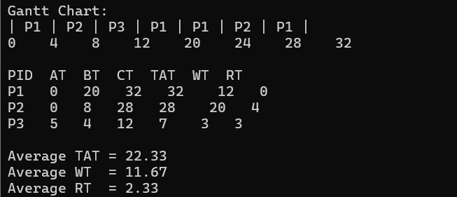

# Project 2 Scheduler Skeleton

 Contributor workflow note:
 1. First understand your assigned task and expected behavior.
 2. Implement your part in the correct module.
 3. Before pushing your implementation, update this README with your part's documentation like what you added and any usage details for your part.
 4. Make a branch as `person1name-person2name-algorithm` then work

This folder is intentionally a skeleton so multiple contributors can work in parallel.

Current status:
- Shared data models are ready.
- Shared reporting functions are ready.
- Main program flow and algorithm selection are ready.
- Algorithm implementations are placeholders only.

## Current Structure

```
G7_Project2_project2/
├── Makefile
├── README.md
├── main.c
├── include/
│   ├── scheduler_types.h
│   ├── scheduler_report.h
│   └── scheduler_algorithms.h
└── src/
		├── report.c
		└── algorithms/
				├── edf.c
				├── lottery.c
				└── mlfq.c
```

## Team Responsibilities

1. Team EDF
- Implement `runEDF(...)` in `src/algorithms/edf.c`.

2. Team Lottery
- Implement `runLottery(...)` in `src/algorithms/lottery.c`.

3. Team MLFQ
- Implement `runMLFQ(...)` in `src/algorithms/mlfq.c`.

## Prototype Rules

- Keep all algorithm prototypes in `include/scheduler_algorithms.h`.
- If you add a new scheduling algorithm:
	- Add its prototype in `include/scheduler_algorithms.h`.
	- Add its source file in `src/algorithms/`.
	- Add selection logic in `main.c`.
	- Add the new source path to `Makefile` under `SOURCES`.

## Shared Files (Do Not Break)

- `include/scheduler_types.h`: shared `Process` and `GanttEntry` structs.
- `include/scheduler_report.h` and `src/report.c`: Gantt printing and metrics logic.
- `main.c`: input collection and algorithm dispatch.

## Build and Run

From this folder:

```bash
make
make run
make clean
```

## Notes for Contributors

- This is a collaboration skeleton, not a completed scheduler project.
- Use the existing function signatures so all files remain compatible.
- Keep changes scoped to your team file whenever possible to avoid merge conflicts.


## MLFQ Implementation details (Sathish and Ishika)
implemented in 'src/algorithms/mlfq.c'
(MLFQ focuses on optimizing process turnaround time and preventing starvation through a dynamic priority system)

### Algorithm logic
* **Queues:** 3 distinct priority levels (Q0, Q1, Q2)
* **Time quantums:** 
	* **Queue 0 (high):** 4 ticks
	* **Queue 1 (medium):** 8 ticks
	* **Queue 2 (low):** FCFS behaviour
* **Preemption:** High-priority processes in Q0 will preempt any running process from Q1 or Q2.
* **Demotion:** Process are demoted to the next lower queue level only after fully exhausting their assigned time quantum.
* **Priority boost:** every **20 ticks**, all processes (regardless of status) are moved back to queue 0 to ensure low-priority tasks also receive CPU time

### Testing and verification
**Test case configuration:**
- **P1:** arrival 0, burst 20
- **P2:** arrival 0, burst 8
- **P3:** arrival 5, burst 4

output image:



### Usage
1. Run 'make rebuild' to compile the new logic
2. Run 'make run'.
3. Choose the MLFQ option (3) from the algorithm selection menu
