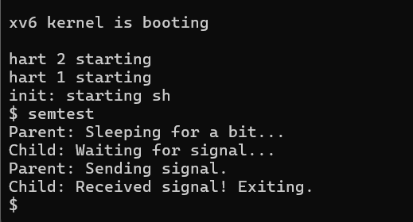

# Operating-Systems-Project
Uni project for OS

## Category 4: Synchronization (Semaphores) -Ishika
(implemented a counting semaphore system to manage process synchronization and prevent race conditions)

###Implementation details:
* **Semaphore Structure**: created a 'struct sem' in 'kernel/proc.h' containing an integer 'value' and a 'spinlock'
* **Kernel logic ('kernel/sem.c')**:
    * 'sem_init': initializes the semaphore value and the spinlock
    * 'sem_wait': uses a 'while' loop to check the value. If it is '\le 0' then it calls the kernel 'sleep()' function to block the process.
    * 'sem_signal': increments the value and calls 'wakeup()' to unblock the waiting processes
* **System call mapping**: integrated the functions into 'syscall.h' and 'syscall.c' (IDs 22-25) and restored 'sys_sleep' in sysproc.c' to allow user-space timing.

### Test results:
The 'semtest' program proves the implementation works. 
i.e. the parent process successfully uses 'sem_signal' to unblock the child process after a 10-tick delay.

 
